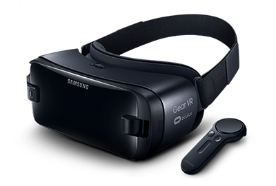
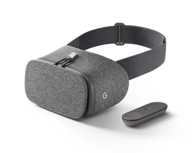
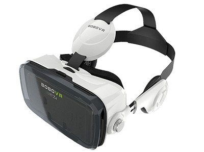
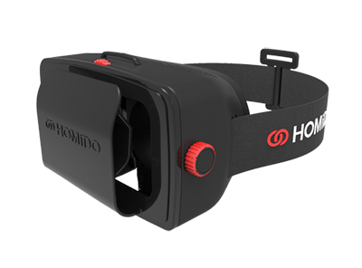
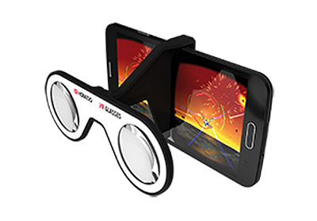

# Introduction to WebVR
## Javascript into the Open Metaverse

---

# VR Setup[^*]

[^*]: Illustrations from Mozilla

---

# VR Experiences
New conciderations for VR app development
**Focus on User Experience**
- Stereoscopic vision & Interpupillary distance (IPD)
- Head tracking & Degrees of Freedom (DoF)
- Cone of focus & Field of view (FOV)
- 3D Positional Audio
- Latency & Framerate (Frames per second / FPS)
**Focus on User Comfort**
- Eye strain
- Motion sickness

---

---

# Native VR Devices (PC & Console)

HTC Vive (room-scale VR)
Oculus Rift
Playstation VR
Fove
Razer OSVR

---

# Mobile VR Devices (Smartphone)

Samsung Gear VR
Daydream
Cardboard
Hundreds of third-party headsets

---

# VR Programming 

- Unreal Engine (C++)
- Unity (C#)
- Source Engine (C++)
- WebVR (JS)

---

# VR Distribution

- [SteamVR](https://steamcommunity.com/steamvr)
- [Google Play](https://play.google.com/store/search?q=vr&c=apps&hl=en)
- [Oculus Store](https://www.oculus.com/experiences/rift/)
- [iTunes]() 
- [The Rift Arcade](http://www.theriftarcade.com/)
- [V](http://www.hellov.io/) "open alternative" to SteamVR

---

# Create responsibly

---

# Virtual Reality on the Web 
## A retrospective

* 1994 VRML - first attempt to create an internet based 3D language. (Mark Pesce presented the Labyrinth demo he developed with Tony Parisi and Peter Kennard.)
* VRML2 (1997) added many features (animation) and later was succeeded by X3D
Problem of VRML: plugin-based technology that only came preinstalled on IE

---

# Virtual Reality on the Web 
## A retrospective

* 2003 OpenGL ES - cross-language and multi-platform 3D graphics API. 
Hardware accelerated rendering of 3D objects.
* WebGL 1.0 introduced by Mozilla based on OpenGL ES uses DOM (canvas element)
* X3D introduced [X3DOM](http://www.web3d.org/hack-web3d-vr/) 

---

# Virtual Reality on the Web 
## Big WebGL Frameworks today

* [Three.js](https://threejs.org/) by [Ricardo Cabello](http://mrdoob.com/) in 2010
* [Scene.js](http://scenejs.org/)
* [Babylon.js](https://www.babylonjs.com/)
* [Turbulenz](http://biz.turbulenz.com/developers)
* [Goo Engine](http://code.gooengine.com/latest/docs/)
* [PlayCanvas.js](https://playcanvas.com/)

---

[WebGL Frameworks Comparison](http://bnjm.github.io/WebGL-framework-comparison/)

---

# What is WebVR?
## WebVR is a *experimental* Javascript API that provides interfaces to VR hardware to allow developers to build compelling, comfortable VR experiences on the web.

---

# WebVR 
**WebVR v1.1** *Editor’s Draft, 04/05/17*
- deviceOrientation
- VRDisplay object handles almost everything
- available on multiple platforms
..soon..
**WebVR (2.0)** *Editor’s Draft, 04/17/17*
- not backwards compatible
- device support 
- introduction of VRDevice & VRSession to replace VRDisplay
- read [Explainer doc](https://github.com/w3c/webvr/blob/master/explainer.md)!

---

# What is WebVR?

**Goals**:

- Detect available Virtual Reality devices. 
- Query the devices capabilities. 
- Poll the device’s position and orientation. 
- Display imagery on the device at the appropriate frame rate.

---

# What is WebVR?

**Non-goals**:

- Define how a Virtual Reality browser would work. 
- Take full advantage of Augmented Reality devices. 
- Build “The Metaverse.”

*check out [https://webvr.rocks/](https://webvr.rocks/) for support updates*

---

# WebVR Frameworks
* [A-Frame](https://aframe.io/) by Mozilla
* [ReactVR](https://facebook.github.io/react-vr/) by Facebook
* [ForgeJS](https://forgejs.org/) by GoPro, Inc., great for 360 photo & video content
* [Primrose](https://primrosevr.com/) great for collaborative VR web apps
* [Janus VR](http://janusvr.com/) VR Browser/Editor
* [Vizor](https://patches.vizor.io/) in-browser VR development, SocialVR
* [GLAM](https://tparisi.github.io/glam/) (GL And Markup) declarative language for 3D web content

---

# Three.js and WebVR

### compared with

# A-Frame

---

# A-Frame

* is a 3DML (3D markup language) like as X3Dom and GLAM
* DOM-based Entity-Component System => declarative & extensible (similar to Unity/UE4/PlayCanvas)

**A-Frame Stack**:

---

vrchive.com

### Simply *drop an image onto the Deckset window* and the Markdown you need to display the image is automatically created and *copied to the clipboard.*

---

* This works with both local files and web images
* You don’t _have_ to drag the file, you can also type the Markdown yourself if you know how

