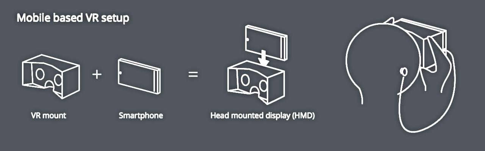
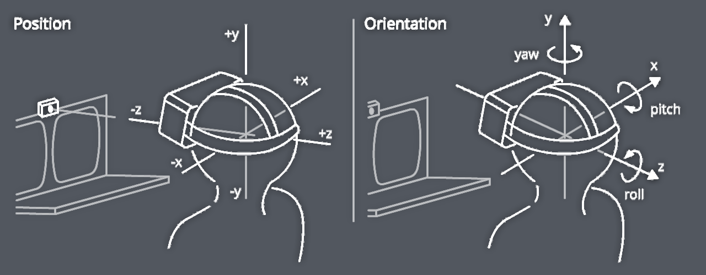
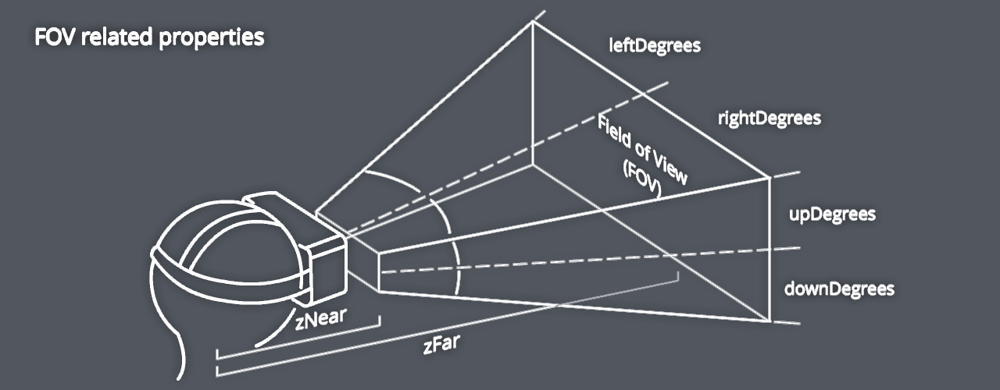
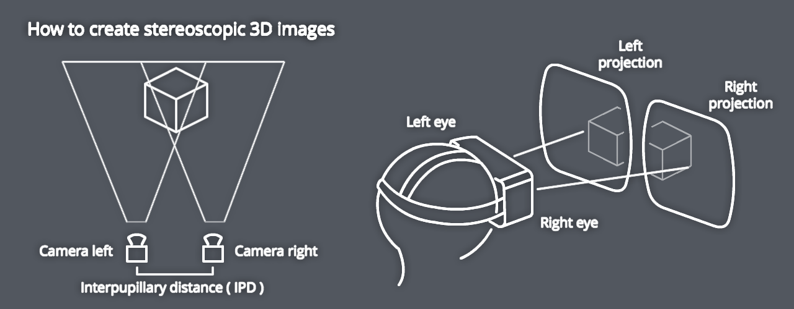
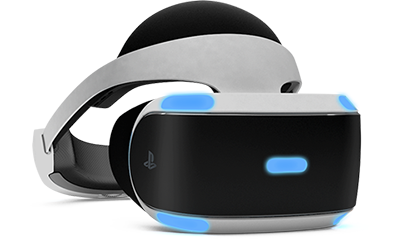
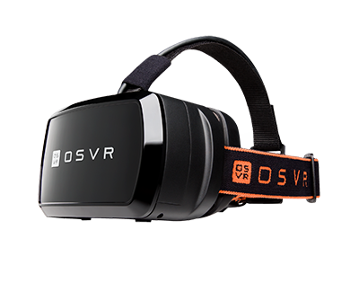
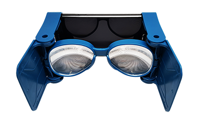
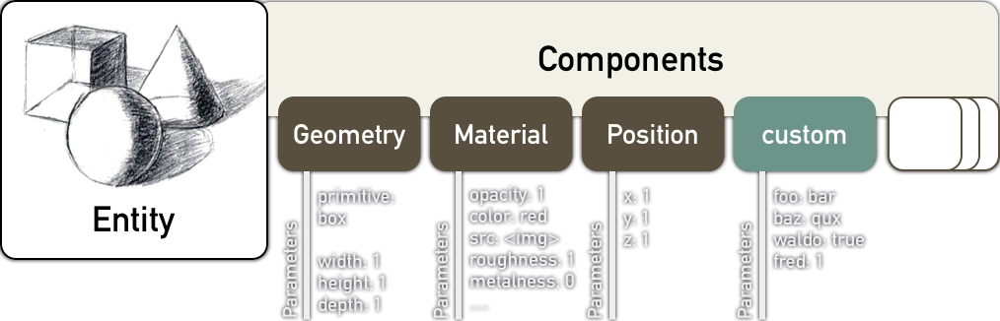

# Introduction to WebVR
## Javascript into the Open Metaverse

---

# VR Setup[^*]



[^*]: Illustrations from Mozilla

---

# VR Experiences
New conciderations for VR app development
**Focus on User Experience**
- Stereoscopic vision & Interpupillary distance (IPD)
- Head tracking & Degrees of Freedom (DoF)
- Cone of focus & Field of view (FOV)
- 3D Positional Audio
- Latency & Framerate (Frames per second / FPS)
**Focus on User Comfort**
- Eye strain
- Motion sickness

---

### Degrees of Freedom, Stereoscopic vision & Interpupillary distance[^*]



 

[^*]: Illustrations from Mozilla

---

# Native VR Devices (PC & Console)



HTC Vive (room-scale VR)
Oculus Rift
Playstation VR
Fove
Razer OSVR

---

# Mobile VR Devices (Smartphone)



Samsung Gear VR
Daydream
Cardboard
Hundreds of third-party headsets

---

# VR Programming 

- Unreal Engine (C++)
- Unity (C#)
- Source Engine (C++)
- WebVR (JS)

---

# VR Distribution

- [SteamVR](https://steamcommunity.com/steamvr)
- [Google Play](https://play.google.com/store/search?q=vr&c=apps&hl=en)
- [Oculus Store](https://www.oculus.com/experiences/rift/)
- [The Rift Arcade](http://www.theriftarcade.com/)
- [V](http://www.hellov.io/) "open alternative" to SteamVR

---

# Why WebVR?

* no app store ecosystem, distribution via internet
* mobile & desktop automatically supported
* uses current tools and libraries for JS
* easy switch between VR & non-VR mode
* interfacing with hardware through the browser

---

### Progressive Enhancement by Arturo Paracuellos 


---

# Virtual Reality on the Web 
## A retrospective 1/2

* 1994 VRML - first attempt to create an internet based 3D language. (Mark Pesce presented the Labyrinth demo he developed with Tony Parisi and Peter Kennard.)
* VRML2 (1997) added many features (animation) and later was succeeded by X3D
Problem of VRML: plugin-based technology that only came preinstalled on IE

---

# Virtual Reality on the Web 
## A retrospective 2/2

* 2003 OpenGL ES - cross-language and multi-platform 3D graphics API. 
Hardware accelerated rendering of 3D objects.
* WebGL 1.0 introduced by Mozilla based on OpenGL ES uses DOM (canvas element)
* X3D introduced [X3DOM](http://www.web3d.org/hack-web3d-vr/) 

---

# Most popular WebGL Engines today

* [Three.js](https://threejs.org/) by [Ricardo Cabello](http://mrdoob.com/) in 2010
* [Babylon.js](https://www.babylonjs.com/)
* [PlayCanvas.js](https://playcanvas.com/)
* [Goo Engine](http://code.gooengine.com/latest/docs/)
* [Scene.js](http://scenejs.org/)
* [Turbulenz](http://biz.turbulenz.com/developers)


---


**Stackoverflow Score growth over time by tag comparison**

[WebGL Framework Comparison](http://bnjm.github.io/WebGL-framework-comparison/)

---

# What is WebVR?
## WebVR is a *experimental* Javascript API that provides interfaces to VR hardware to allow developers to build compelling, comfortable VR experiences on the web.

---

# WebVR 
**WebVR v1.1** *Editor’s Draft, 04/05/17*
- deviceOrientation
- VRDisplay object handles almost everything
- available on multiple platforms
..soon..
**WebVR (2.0)** *Editor’s Draft, 04/17/17*
- not backwards compatible
- device support 
- introduction of VRDevice & VRSession to replace VRDisplay
- read [Explainer doc](https://github.com/w3c/webvr/blob/master/explainer.md)!

---

# Goals of WebVR

- Detect available Virtual Reality devices. 
- Query the devices capabilities. 
- Poll the device’s position and orientation. 
- Display imagery on the device at the appropriate frame rate.

---

# Non-goals of WebVR

- Define how a Virtual Reality browser would work. 
- Take full advantage of Augmented Reality devices. 
- Build “The Metaverse.”

*check out [https://webvr.rocks/](https://webvr.rocks/) for support updates*

---

# WebVR Frameworks

* [A-Frame](https://aframe.io/) by Mozilla
* [ReactVR](https://facebook.github.io/react-vr/) by Facebook
* [ForgeJS](https://forgejs.org/) by GoPro, Inc., great for 360 photo & video content
* [Primrose](https://primrosevr.com/) great for collaborative VR web apps
* [Janus VR](http://janusvr.com/) VR Browser/Editor
* [Vizor](https://patches.vizor.io/) in-browser VR development, SocialVR
* [GLAM](https://tparisi.github.io/glam/) (GL And Markup) declarative language for 3D web content

---

# Demo [A](http://localhost:8888/01_ThreeJS_photosphere.html) [B](http://localhost:8888/02_A-Frame_photosphere.html)

---

# Three.js and WebVR


### compared with

# A-Frame


---

# A-Frame

* is a 3DML (3D markup language) like as X3Dom and GLAM
* DOM-based Entity-Component System => declarative & extensible (similar to Unity/UE4/PlayCanvas)

**A-Frame Stack**:


---

# A-Frame
## Entity-Component System



---

# A-Frame

- Entities are HTML elements (i.e., `<a-entity> `)
- Components are HTML attributes, set on the entity

```html 
<body>
	<a-scene>
		<a-entity geometry="primitive:box" material="color:#c00">
		</a-entity>
	</a-scene>
</body>
```
---

# Entity

* general purpose objects (e.g. create a player, ball, or field)
* inherently have position, rotation and scale in scene

```html 
	<a-entity 
		geometry="primitive:box; 
				  width:0.2; 
				  height:0.3;
				  depth:0.5;" 
		material="color:#c00" 
		position="0 0 -1" 
		rotation="0 30 30" 
		material="color:#c00">
	</a-entity>

```

---

# Primitives (concise, semantic building blocks)

```html 
	<a-entity geometry="primitive:box; 
						width:0.2; 
						height:0.3; 
						depth:0.5;" 
			  material="color:#c00">
	</a-entity>
```


```html 
	<a-box width="0.2" 
		   height="0.3" 
		   depth="0.5" 
		   material="color:#c00">
	</a-box>
```

---

# Mixins

```html 
	<a-mixin id="box" 
			 geometry="primitive:box; 
					   width:0.2; 
					   height:0.3; 
					   depth:0.5;" 
			 material="color:#c00">					 
	</a-mixin>

	<a-entity mixin="box">
	</a-entity>
```

---

# Custom Components

```javascript 
	AFRAME.registerComponent('foo', {
		schema: {
			bar: {type: 'number'},
			baz: {type: 'string'}
		},
		init: function () {
			// Do something when component is plugged in.
		},
		update: function () {
			// Do something when component's data is updated.
		}
	});
```

---

# Gaze-Based Control


---

# Gaze-Based Cursor Interactions

```javascript 
  	AFRAME.registerComponent('clickable', {
    	init: function () {
          	var el = this.el;
          	el.addEventListener('mouseenter', function () {
            	el.setAttribute('color', '#f00');
          	});
          	el.addEventListener('mouseleave', function () {
            	el.setAttribute('color', '#fff');
          	});
          	el.addEventListener('click', function () {
            	el.setAttribute('material', 'src' , 'assets/football.png');
          	});
        } 
  	});
```

```html 
	<a-sphere clickable src="assets/basketball.png" radius="0.5" color="#fff"></a-sphere>
	<a-camera><a-cursor></a-cursor></a-camera>
```

---

# A-Frame Component Registry


---

# https://aframe.io/docs/0.5.0/


---

## A-Frame Inspector <br/> `[control]+[option]+[i]`


---

# Create responsibly!


---

**Resources**
* [A-Frame Slack](https://aframevr-slack.herokuapp.com/)
* [A-Frame Component Registry](https://aframe.io/aframe-registry/)
* [mozvr.com](https://mozvr.com/)
* [VR Gets Real with WebVR](https://medium.com/@rolanddubois/vr-gets-real-174fdafcad4f)
* [WebVR API](https://developer.mozilla.org/en-US/docs/Web/API/WebVR_API)
* [The UX of VR](http://www.uxofvr.com/)

**Get In Touch**
@rolanddubois
rolanddubois.com

*Code Time!*

--- 

# What we will be building

* [github.com/rdub80/Ferguson-VR-Hackathon](https://github.com/rdub80/Ferguson-VR-Hackathon)
* [XAMPP](https://www.apachefriends.org/index.html), [MAMP](https://www.mamp.info/en/) or ``` $ python -m SimpleHTTPServer ``` 
* [**JSBin**](https://jsbin.com)


